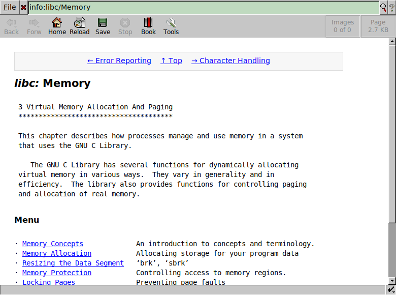

# GNU Info plugin for Dillo

[GNU Info](https://en.wikipedia.org/wiki/Info_%28Unix%29) plugin for [Dillo][].
Renders info pages as HTML, based on the old
[html2info](https://github.com/AdamDanischewski/info2html) Perl script.

## Screenshot



## Install

Requires `perl` with the `File::Basename` and `URI:Escape` modules.

To install use:

```sh
$ make install
```

## Sites to try

- <info:> or <info:dir> provides a directory of all pages.
- <info:gcc> to load the top-level node in GCC file.
- <info:gcc/Standards> go to a specific node in the GCC manual.

[Dillo]: https://dillo-browser.github.io/
